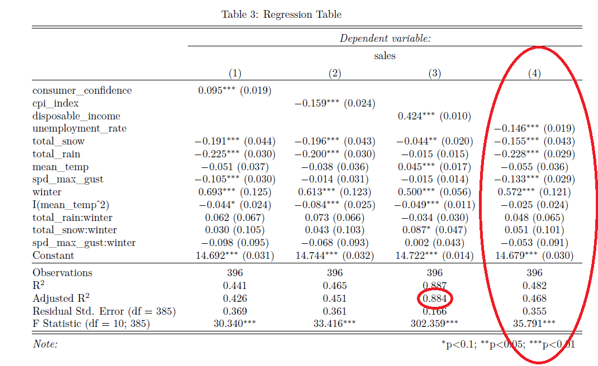
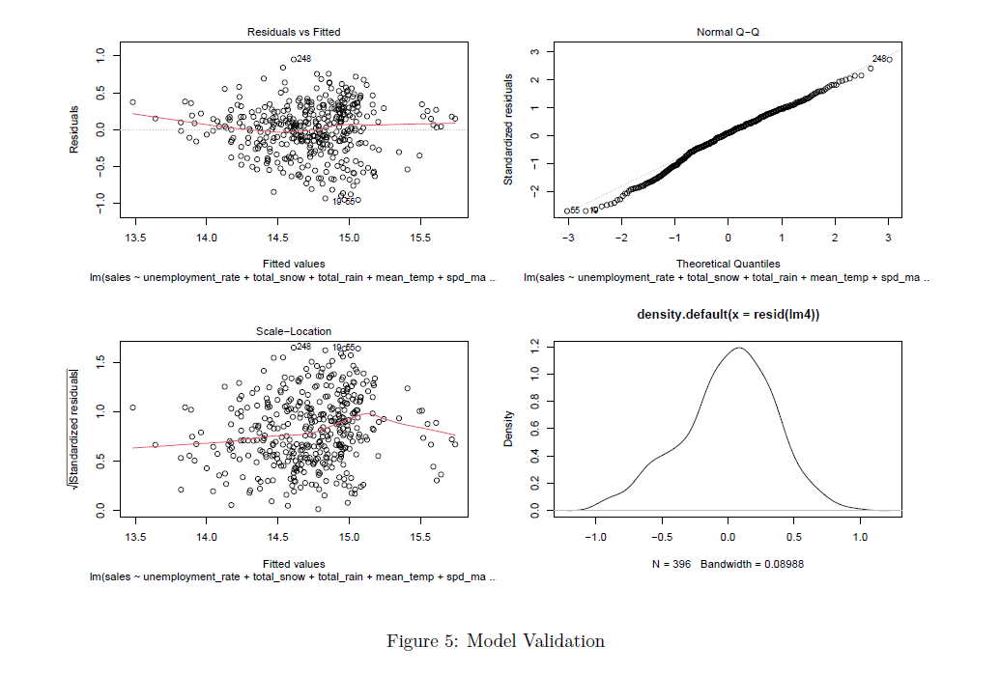

```{r setup, include=FALSE}
source("projectScript.R")
knitr::opts_chunk$set(echo = FALSE)
```


# 1. Objective 

<h>To determine the impact of weather on consumer behavior and retail sales</h>

# 2. Why? 

- Physiological
- Psychological

# 3. Methodology

- **Dependent Variable:**
  - Monthly Retail Sales for the Clothing and Footwear Industry by QC, ON, and BC
- **Independent Variables:**
  - Total Snow
  - Mean Temperature
  - Total Rain
  - Wind Speed
- **Control Variables:**
  - CPI
  - Unemployment Rate
  - Disposable Income
  - Consumer Confidence
  

# a) Correlation Matrix
```{r 1, echo=FALSE, out.width = '100%', fig.align="center"}
knitr::include_graphics("Images/Figure2.png")
```

# b) Distribution Analysis
```{r 2, echo=FALSE, out.width = '100%', fig.align="center"}
knitr::include_graphics("Images/Figure1.png")
```

# c) Multivariate Analysis
```{r 3, echo=FALSE, out.width = '100%', fig.align="center"}

```

# a) Result
```{r 4, echo=FALSE, out.width = '100%', fig.align="center"}

```

# b) Validation
```{r 5, echo=FALSE, out.width = '100%', fig.align="center"}

```

# 6. Conclusion
- H1: Retail Sales decreases with rainfall \checkmark
- H2: Retail Sales decreases with snowfall \checkmark
- H3: Retail Sales decreases with wind speed \checkmark
- H4: Retail Sales is negatively related to mean temperature X


